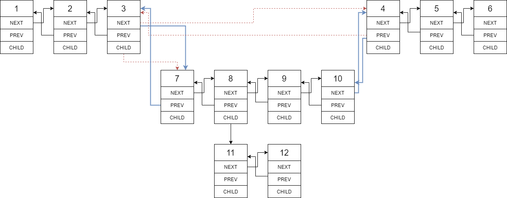

## Problem

<p>You are given a doubly linked list which in addition to the next and previous pointers, it could have a child pointer, which may or may not point to a separate doubly linked list. These child lists may have one or more children of their own, and so on, to produce a multilevel data structure, as shown in the example below.</p>

<p>Flatten the list so that all the nodes appear in a single-level, doubly linked list. You are given the head of the first level of the list.</p>

<p>&nbsp;</p>
<p><strong>Example 1:</strong></p>

<pre>
<strong>Input:</strong> head = [1,2,3,4,5,6,null,null,null,7,8,9,10,null,null,11,12]
<strong>Output:</strong> [1,2,3,7,8,11,12,9,10,4,5,6]
<strong>Explanation:
</strong>
The multilevel linked list in the input is as follows:


After flattening the multilevel linked list it becomes:


</pre>

<p><strong>Example 2:</strong></p>

<pre>
<strong>Input:</strong> head = [1,2,null,3]
<strong>Output:</strong> [1,3,2]
<strong>Explanation:

</strong>The input multilevel linked list is as follows:

  1---2---NULL
  |
  3---NULL
</pre>

<p><strong>Example 3:</strong></p>

<pre>
<strong>Input:</strong> head = []
<strong>Output:</strong> []
</pre>

<p>&nbsp;</p>

<p><strong>How&nbsp;multilevel linked list is represented in test case:</strong></p>

<p>We use the&nbsp;multilevel linked list from <strong>Example 1</strong> above:</p>

<pre>
 1---2---3---4---5---6--NULL
         |
         7---8---9---10--NULL
             |
             11--12--NULL</pre>

<p>The serialization of each level is as follows:</p>

<pre>
[1,2,3,4,5,6,null]
[7,8,9,10,null]
[11,12,null]
</pre>

<p>To serialize all levels together we will add nulls in each level to signify no node connects to the upper node of the previous level. The serialization becomes:</p>

<pre>
[1,2,3,4,5,6,null]
[null,null,7,8,9,10,null]
[null,11,12,null]
</pre>

<p>Merging the serialization of each level and removing trailing nulls we obtain:</p>

<pre>
[1,2,3,4,5,6,null,null,null,7,8,9,10,null,null,11,12]</pre>

<p>&nbsp;</p>
<p><strong>Constraints:</strong></p>

<ul>
	<li>Number of Nodes will not exceed 1000.</li>
	<li><code>1 &lt;= Node.val &lt;= 10^5</code></li>
</ul>

## Discussion

The problem looks to be complicated, but rather straight forward once we
visualize the flow.

Consider the default testcase of this question:


Handling the case with child nodes' presence, we have to perform action
among nodes: `3`, `4`, `7` and `10`, as in the below diagram. Wheres
`red dotted arrow` indicates pointer to be removed, while the `blue arrows` are
pointers to be added.



After one step of flattening the child node's list is merged, and we can see
any nested child nodes will be scanned and merged with the same operation, as we
scanning down along the master list.


We can see that keep doing the same operation, the existing list structure will
not be destroyed and we can scan down the list. Hence we basically construct
the operation required and it's done.

### Solution

We use `ptr` to handle the current scanning node, and so any operation
won't change the existing scanning node's structure. After we come up with
the operations with `ptr`, we just keep doing it along the iteration down
the linked list.

```py3
# Definition for a Node.
class Node:
    def __init__(self, val, prev, next, child):
        self.val = val
        self.prev = prev
        self.next = next
        self.child = child

class Solution:
    def flatten(self, head: 'Node') -> 'Node':
        ptr = head

        while ptr:
            if ptr.child:
                next = ptr.next
                ptr.next = ptr.child
                ptr.child.prev = ptr

                while ptr.child.next:
                    ptr.child = ptr.child.next

                if next:
                    next.prev = ptr.child

                ptr.child.next = next
                ptr.child = None

            ptr = ptr.next

        return head
```

### Complexity Analysis

- Time Complexity: `O(n)`, as we iterate along the linked-list, and nodes in
  child-linked-list are iterated twice.

- Space Complexity: `O(1)`, as only temporary variables are saved during the
  operation.
